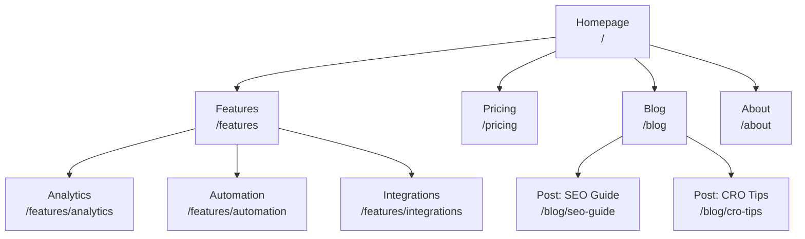
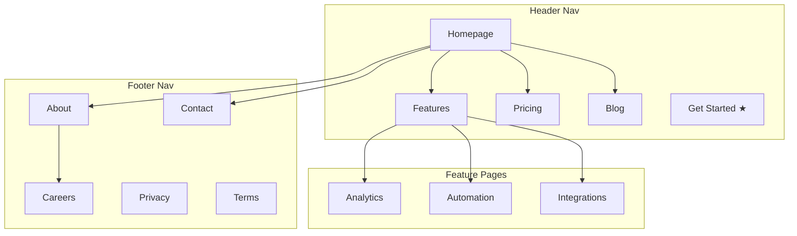
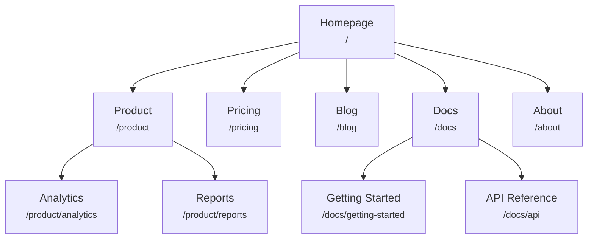
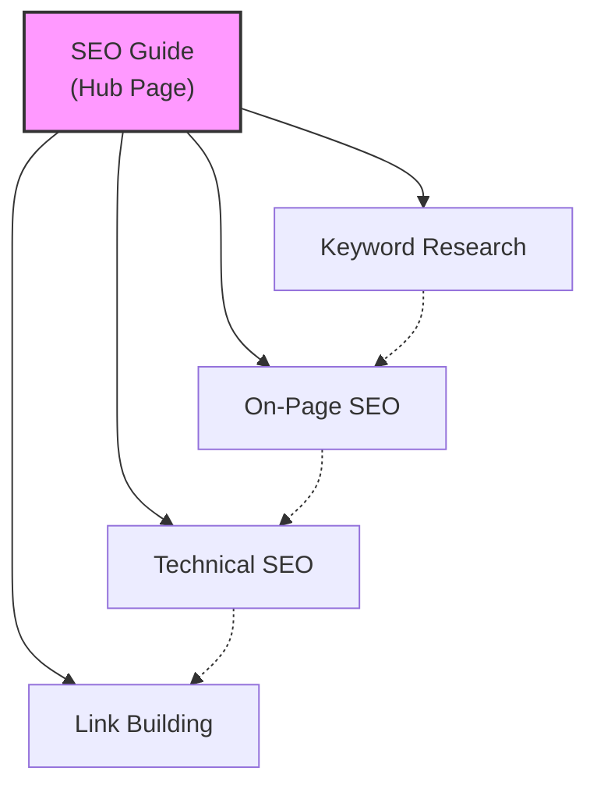
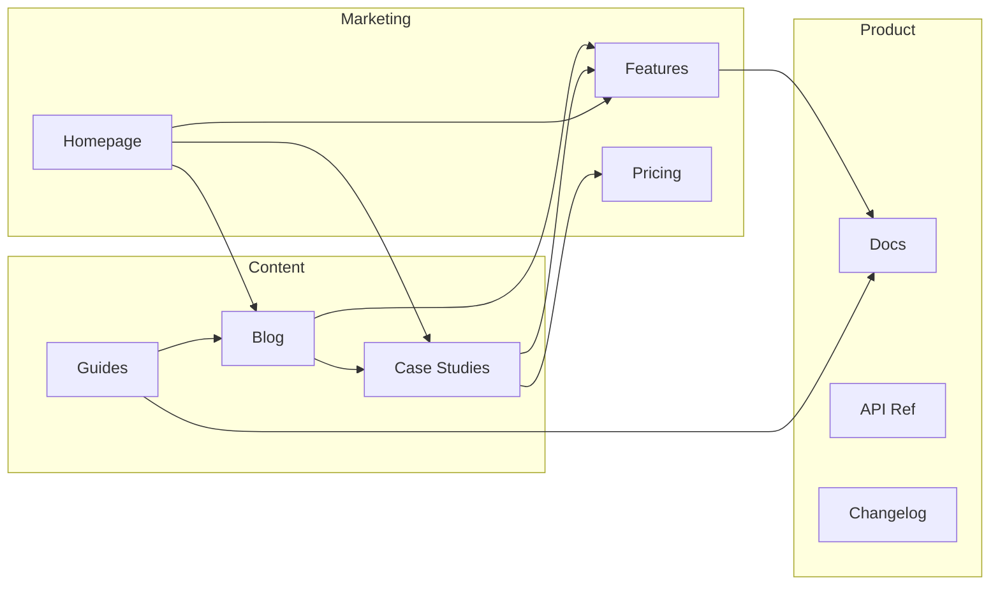
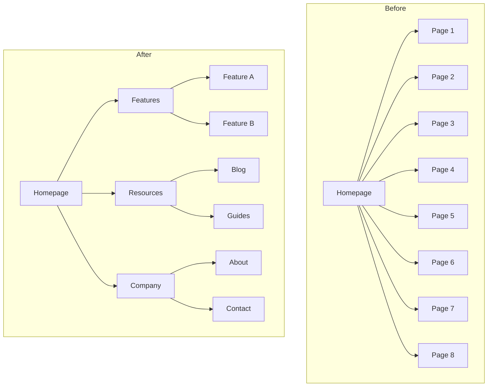
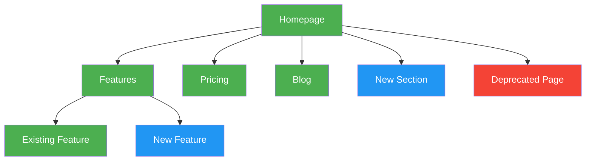

# Plantillas de Diagramas Mermaid

Diagramas Mermaid listos para copiar y pegar para sitemaps visuales. Personaliza las etiquetas de los nodos y las conexiones para tu sitio.

---

## Jerarquía Básica

Jerarquía de páginas simple de arriba hacia abajo.

---

## Jerarquía con Zonas de Navegación

Usa subgráficos para mostrar qué páginas aparecen en qué área de navegación.

---

## Jerarquía con Etiquetas de URL

Cada nodo muestra el nombre de la página y la ruta URL.

---

## Modelo de Contenido Hub-and-Spoke

Muestra una página hub conectada a artículos spoke, con los spokes enlazándose entre sí.

Leyenda:
- Líneas sólidas = enlaces primarios hub-spoke
- Líneas punteadas = enlaces cruzados entre spokes

---

## Flujo de Enlazado Interno

Muestra cómo las diferentes secciones del sitio se enlazan entre sí.

---

## Antes/Después de Reestructurar

Compara las estructuras del sitio actual y propuesta lado a lado.

---

## Convenciones de Codificación por Color

Usa estilos para resaltar el estado, prioridad o tipo de una página.

Clave de colores:
- **Verde** (`#4CAF50`): Páginas existentes (sin cambios)
- **Azul** (`#2196F3`): Páginas nuevas a crear
- **Rojo** (`#f44336`): Páginas a eliminar o redirigir
- **Amarillo** (`#FFC107`): Páginas a reestructurar o mover
- **Morado** (`#9C27B0`): Páginas de alta prioridad / CTA
